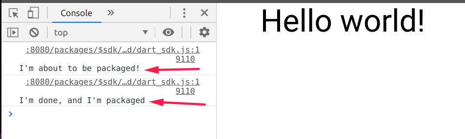
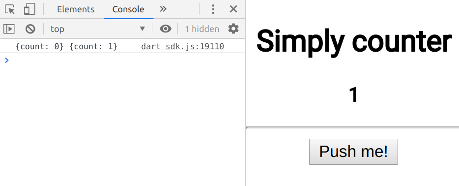
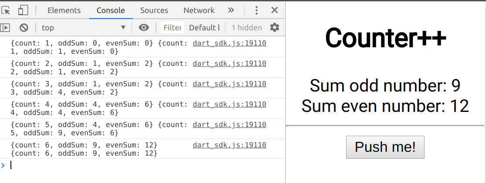
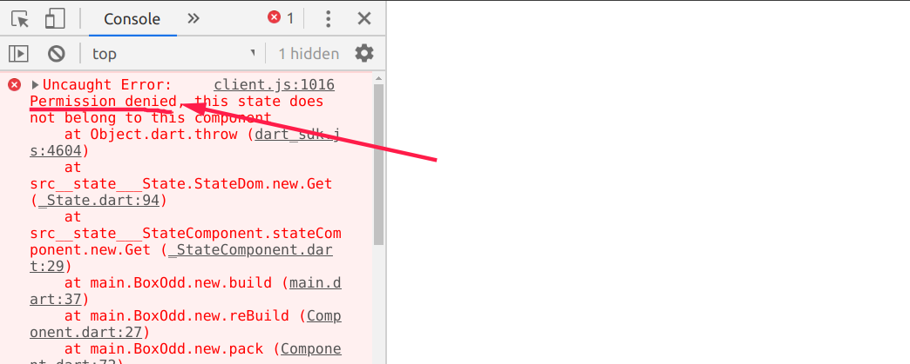

# Dartu

> <span style="color:#f00">**This package must absolutely not be used in production. Does not contain Test, does not contain Assert, does not contain sufficient controls to be mature package.**</span>

Dartu is a package that offers the necessary to create a SPA (single page application).

Inside the package we have elements for creating the Layout and it also offers the creation of components with state.

Dartu also offers an internal system for communication between components, through a system of permits

---

#### How to start an example

Dartu is currently not on Pub.dev but soon it will be...

To start an example, which we will mention in this readme will suffice

* Installation of the Sdk Dart and put into Global "webdev"
* clone this repository
* open the terminal in an examples folder and run the dev server
   `webdev serve --auto refresh`

---

#### Layout 

The following lines will suffice to build a first Hello World with Dartu

```dart
import 'dart:html';

import "package:dartu/dartu.dart";

main() {
  var app = packNodes(Div(child: Center(text: "Hello World!")));

  var root = querySelector("#root");
  if (root != null) {
    root.append(app);
  }
}
```

**Note:** *If you have problems running the code, or initializing the environment, you can find the example at the following [link](examples/helloWorld/)*

#### Life Cycle of Component

each component has an internal state of rendering, the states within Dartu are only two:

* beforePack
* afterPack

the concept of the pack is a concept of transformation of the high level component into a lower level component! for this, I chose this name.

in this document we will not examine the concept of packs, we will simply see how they work and how we can observe it:

```dart
import 'dart:html';

import "package:dartu/dartu.dart";

main() {
  var app = packNodes(Div(child: MyHelloWorld()));

  var root = querySelector("#root");
  if (root != null) {
    root.append(app);
  }
}

class MyHelloWorld extends Component {
  @override
  beforePack() {
    print("I'm about to be packaged!");
  }

  @override
  afterPack() {
    print("I'm done, and I'm packaged");
  }

  @override
  DomComponent build() {
    return Center(text: "Hello world!");
  }
}
```

From this it results in the terminal



#### State

Each component can have a state. Only components that extend the "Component" class can have a status.

The state is not associated with a component, (this we will see shortly) for now we simply create a state and see how it is used.
This is a simple application that counts for us every time we click on the button:

```dart
import 'dart:html';

import "package:dartu/dartu.dart";

main() {
  var app = packNodes(Div(child: Counter()));

  var root = querySelector("#root");
  if (root != null) {
    root.append(app);
  }
}

class Counter extends Component {
  @override
  beforePack() {
    this.createState(initState: {"count": 0}, autoRefresh: true);
  }

  @override
  DomComponent build() {
    int c = this.state.Get(["count"])["count"];
    return Center(children: [
      H2(text: "Simply counter"),
      P(child: B(text: c.toString())),
      HR(),
      Button(
          text: "Push me!",
          onPressed: (e) {
            this.state.Set({"count": ++c});
          })
    ]);
  }
}
```

*complete example [counter app](./example/counter/)*

in this example, we have created a state with function `createState`, given the fact that our component does not have a state, dartu has assigned the status to our component

```dart
// signature of createState version 0.0.1
void createState(
      {String ID,
      Map<String, dynamic> initState,
      List<String> idsPermisionOfCreate,
      List<String> idsPermisionOfRead,
      List<String> idsPermisionOfUpdate,
      List<String> idsPermisionOfDelete,
      bool autoRefresh: false})
```

here I give a brief explanation of the parameters:

* **ID** This is a string that if not assigned will be randomly assigned. The string is used for the shared states that we will see in a few paragraphs
* **initState** This is a Map that indicates a default value for setting the status
* **idsPermisionOf\*** These are all lists of strings, which we will see their role in a few paragraphs, when we talk about "permissions"
* **autoRefresh** This is an important value, basic Dartu does not apply the auto refresh of your components, you have to ask for it explicitly, or you can call an auto refresh when we want in the next example, we call "reBuild" a function that takes care of refreshing the component

*Example of using the Update function, and the "rebuild" function*

```dart
import 'dart:html';

import "package:dartu/dartu.dart";

main() {
  var app = packNodes(Div(child: Counter()));

  var root = querySelector("#root");
  if (root != null) {
    root.append(app);
  }
}

class Counter extends Component {
  @override
  beforePack() {
    this.createState(initState: {"count": 0}, autoRefresh: false);
  }

  update(oldState, newState) {
    print("$oldState $newState");
    this.reBuild();
  }

  @override
  DomComponent build() {
    int c = this.state.Get(["count"])["count"];
    return Center(children: [
      H2(text: "Simply counter"),
      P(child: B(text: c.toString())),
      HR(),
      Button(
          text: "Push me!",
          onPressed: (e) {
            this.state.Set({"count": ++c});
          })
    ]);
  }
}
```

This is our Counter, but this time we manually forced the refresh by calling the "reBuild" function

while Update is a function that is called whenever the status is updated, it reports the old status and the new status.



*Here an example of the result in the terminal*

#### Shared States

An interesting feature that I allowed inside dartu, is the existence of shared states.
Two or many more components can share the same status independently and be updated both.

in this example we have three components: a button, and two boxes.
in the box on the right we add only the even numbers, while on the left only the odd ones, while the button will continue to add one unit. We can call it counter ++

```dart
import 'dart:html';

import "package:dartu/dartu.dart";

main() {
  var app = packNodes(Div(child: CounterPP()));

  var root = querySelector("#root");
  if (root != null) {
    root.append(app);
  }
}

class BoxEven extends Component {
  beforePack() {
    this.createState(ID: "Counter++", autoRefresh: true);
  }

  @override
  DomComponent build() {
    int even = this.state.Get(["evenSum"])["evenSum"];
    return Div(text: "Sum even number: $even");
  }
}

class BoxOdd extends Component {
  beforePack() {
    this.createState(ID: "Counter++", autoRefresh: true);
  }

  @override
  DomComponent build() {
    int odd = this.state.Get(["oddSum"])["oddSum"];
    return Div(text: "Sum  odd number: $odd");
  }
}

class CounterPP extends Component {
  @override
  beforePack() {
    this.createState(
        ID: "Counter++",
        initState: {"count": 0, "oddSum": 0, "evenSum": 0},
        autoRefresh: false);
  }

  update(oldState, newState) {
    print("$oldState $newState");
  }

  @override
  DomComponent build() {
    int c = this.state.Get(["count"])["count"];
    return Center(children: [
      H2(text: "Counter++"),
      Div(children: [BoxOdd(), BoxEven()]),
      HR(),
      Button(
          text: "Push me!",
          onPressed: (e) {
            ++c;
            var s = this.state.Get(["evenSum", "oddSum"]);
            if (c % 2 == 0) {
              s["evenSum"] += c;
            } else {
              s["oddSum"] += c;
            }
            this.state.Set(
                {"count": c, "evenSum": s["evenSum"], "oddSum": s["oddSum"]});
          })
    ]);
  }
}

```

*You can find this example [here](examples/counterpp/)*

In the terminal the result is the following:



every component is updated, the update method is called by everyone! but in the example we print only the one of the class CounterPP (so as not to have equal outputs), I point out how `autoRefresh` is set to "true" only in the BoxOdd and BoxEven classes, this will ensure that all the status updates are notified in their own it works "update" but not all of them are rendered in fact only the boxes are rendered

#### Permissions

The practice of sharing the state in large components can be useful, but Dartu also offers a communication between states regulated by permits.

(for now there is an example are the Read permission, I hope in the future to bring other examples in the documentation)

```dart
import 'dart:html';

import "package:dartu/dartu.dart";

main() {
  var app = packNodes(Div(child: CounterPP()));

  var root = querySelector("#root");
  if (root != null) {
    root.append(app);
  }
}

class BoxEven extends Component {
  StateComponent counterState;
  beforePack() {
    this.createState(ID: "BoxEven", autoRefresh: true);
    this.counterState = this.foreignState("Counter++");
  }

  @override
  DomComponent build() {
    var even = this.counterState.Get(["evenSum"])["evenSum"];
    return Div(text: "Sum even number: $even");
  }
}

class BoxOdd extends Component {
  StateComponent counterState;
  beforePack() {
    this.createState(ID: "BoxOdd", autoRefresh: true);
    this.counterState = this.foreignState("Counter++");
  }

  @override
  DomComponent build() {
    var odd = this.counterState.Get(["oddSum"])["oddSum"];
    return Div(text: "Sum  odd number: $odd");
  }
}

class CounterPP extends Component {
  @override
  beforePack() {
    this.createState(
        ID: "Counter++",
        initState: {"count": 0, "oddSum": 0, "evenSum": 0},
        autoRefresh: false);
  }

  update(oldState, newState) {
    print("$oldState $newState");
  }

  @override
  DomComponent build() {
    int c = this.state.Get(["count"])["count"];
    return Center(children: [
      H2(text: "Counter++"),
      Div(children: [BoxOdd(), BoxEven()]),
      HR(),
      Button(
          text: "Push me!",
          onPressed: (e) {
            ++c;
            var s = this.state.Get(["evenSum", "oddSum"]);
            if (c % 2 == 0) {
              s["evenSum"] += c;
            } else {
              s["oddSum"] += c;
            }
            this.state.Set(
                {"count": c, "evenSum": s["evenSum"], "oddSum": s["oddSum"]});
          })
    ]);
  }
}
```

**This code produces an error!**



This happens because we have not given reading permission, we can give more permissions which are:

+ **Create** it is a permit for the creation of new keys within the state
+ **Read** it is a permission to read all the keys and values of the state
+ **Update** it is a permission to write on an existing key, (if I have permission create but not update I can no longer write on that key but only create it)
+ **Delete** This permission is not entirely used, it is used in the Reset state, but for now it is not implemented


Let's see the code:

```dart
import 'dart:html';

import "package:dartu/dartu.dart";

main() {
  var app = packNodes(Div(child: CounterPP()));

  var root = querySelector("#root");
  if (root != null) {
    root.append(app);
  }
}

class BoxEven extends Component {
  StateComponent counterState;
  beforePack() {
    this.createState(ID: "BoxEven", autoRefresh: true);
    this.counterState = this.foreignState("Counter++");
  }

  @override
  DomComponent build() {
    var even = this.counterState.Get(["evenSum"])["evenSum"];
    return Div(text: "Sum even number: $even");
  }
}

class BoxOdd extends Component {
  StateComponent counterState;
  beforePack() {
    this.createState(ID: "BoxOdd", autoRefresh: true);
    this.counterState = this.foreignState("Counter++");
  }

  @override
  DomComponent build() {
    var odd = this.counterState.Get(["oddSum"])["oddSum"];
    return Div(text: "Sum  odd number: $odd");
  }
}

class CounterPP extends Component {
  @override
  beforePack() {
    this.createState(
        ID: "Counter++",
        initState: {"count": 0, "oddSum": 0, "evenSum": 0},
        idsPermisionOfRead: ["BoxEven", "BoxOdd"],
        autoRefresh: false);
  }

  update(oldState, newState) {
    print("$oldState $newState");
  }

  @override
  DomComponent build() {
    int c = this.state.Get(["count"])["count"];
    return Center(children: [
      H2(text: "Counter++"),
      Div(children: [BoxOdd(), BoxEven()]),
      HR(),
      Button(
          text: "Push me!",
          onPressed: (e) {
            ++c;
            var s = this.state.Get(["evenSum", "oddSum"]);
            if (c % 2 == 0) {
              s["evenSum"] += c;
            } else {
              s["oddSum"] += c;
            }
            this.state.Set(
                {"count": c, "evenSum": s["evenSum"], "oddSum": s["oddSum"]});
          })
    ]);
  }
}
```

*This is the code of the example of our counter ++ but with the permissions, you can find it [here](examples/counterWithPermision/).*

The line that doesn't make us go wrong is in the "Counte++" status statement indicating which other states can access.
In fact we should not imagine the descriptive line "Counter ++" as a label we give to a state, but also as a component name, through that name we can access other states.
If we do not indicate "ID" in the "createState" function, a name will be generated for the random status.

```dart
 this.createState(
        ID: "Counter++",
        initState: {"count": 0, "oddSum": 0, "evenSum": 0},
        idsPermisionOfRead: ["BoxEven", "BoxOdd"],
        autoRefresh: false);
```

```idsPermisionOfRead: ["BoxEven", "BoxOdd"]```  Only the "BoxOdd" and "BoxEven" states can access the counter status, and only with read permission. They can't write!